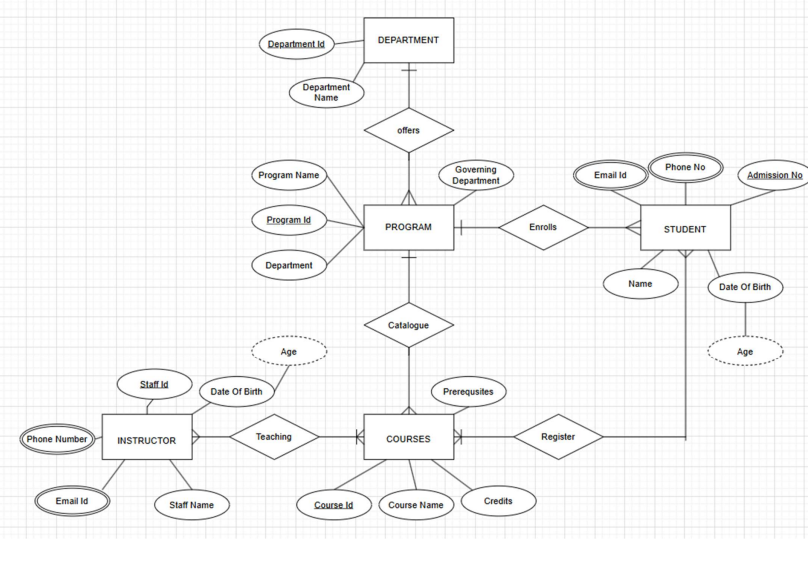

# Experiment 1: Entity-Relationship (ER) Diagram

## 🎯 Objective:
To understand and apply the concepts of ER modeling by creating an ER diagram for a real-world application.

## 📚 Purpose:
The purpose of this workshop is to gain hands-on experience in designing ER diagrams that visually represent the structure of a database including entities, relationships, attributes, and constraints.

---

## 🧪 Choose One Scenario:

### 🔹 Scenario 1: University Database
Design a database to manage students, instructors, programs, courses, and student enrollments. Include prerequisites for courses.

**User Requirements:**
- Academic programs grouped under departments.
- Students have admission number, name, DOB, contact info.
- Instructors with staff number, contact info, etc.
- Courses have number, name, credits.
- Track course enrollments by students and enrollment date.
- Add support for prerequisites (some courses require others).

---

### 🔹 Scenario 2: Hospital Database
Design a database for patient management, appointments, medical records, and billing.

**User Requirements:**
- Patient details including contact and insurance.
- Doctors and their departments, contact info, specialization.
- Appointments with reason, time, patient-doctor link.
- Medical records with treatments, diagnosis, test results.
- Billing and payment details for each appointment.

---

## 📝 Tasks:
1. Identify entities, relationships, and attributes.
2. Draw the ER diagram using any tool (draw.io, dbdiagram.io, hand-drawn and scanned).
3. Include:
   - Cardinality & participation constraints
   - Prerequisites for University OR Billing for Hospital
4. Explain:
   - Why you chose the entities and relationships.
   - How you modeled prerequisites or billing.

# ER Diagram Submission - Student Name

## Scenario Chosen:
University

## ER Diagram:

## Entities and Attributes:
#### 1. DEPARTMENT: 
Department ID, Department Name

#### 2. PROGRAM: 
Program ID, Program Name, Governing Department

#### 3. STUDENT: 
Admission Number, Name, Email ID, Phone Number, Date of Birth, Age

#### 4. COURSES: 
Course ID, Course Name, Credits, Prerequisites

#### 5. INSTRUCTOR: 
Staff ID, Name, Email ID, Phone Number, Date of Birth
...

## Relationships and Constraints:
#### 1. DEPARTMENT offers PROGRAM

* _Cardinality_: One-to-Many

* _Participation_: Total (each program belongs to exactly one department)

#### 2. PROGRAM enrolls STUDENT

* _Cardinality_: Many-to-Many

* _Participation_: Partial (a student can be enrolled in multiple programs, but not every student belongs to a program)

#### 3. COURSES catalog PROGRAM

* _Cardinality_: Many-to-One

* _Participation_: Total (every course must be associated with a program)

#### 4. STUDENT registers for COURSES

* _Cardinality_: Many-to-Many

* _Participation_: Partial

#### 5. INSTRUCTOR teaches COURSES

* _Cardinality_: Many-to-Many

* _Participation_: Partial

#### 6. COURSES have prerequisites

* _Cardinality_: Many-to-Many

* _Participation_: Partial
...

## Extension (Prerequisite):
 * Prerequisites are represented as a self-referencing many-to-many relationship on the COURSES entity. This allows the flexibility to:

   * Define multiple prerequisites for a single course.

   * Assign a single course as a prerequisite to multiple other courses.

## Design Choices:
1. _Entity Selection_: The entities were chosen to mirror the key components of an academic institution—departments, programs, students, courses, and instructors—to ensure a comprehensive database structure.

2. _Relationships_: The relationships were established to represent real-world interactions effectively, like enrollment, teaching, and course prerequisites.

3. _Assumptions_: To maintain consistency:

   * Each program belongs to one department.

   * Each course must belong to a program.

   * Instructors may teach multiple courses and vice versa.

* These design decisions ensure the database is both scalable and adheres to academic institution requirements.

## RESULT
Thus, to understand and apply the concepts of ER modeling by creating an ER diagram for a real-world application has been done successfully.