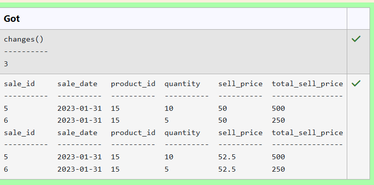
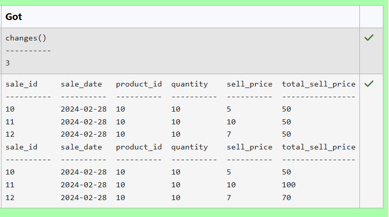
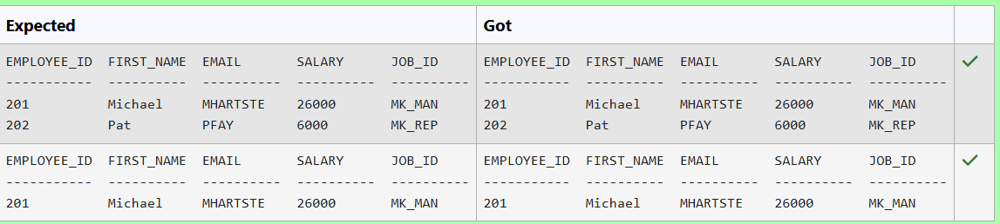
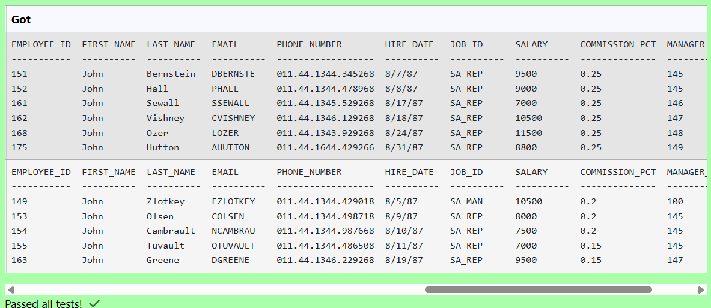
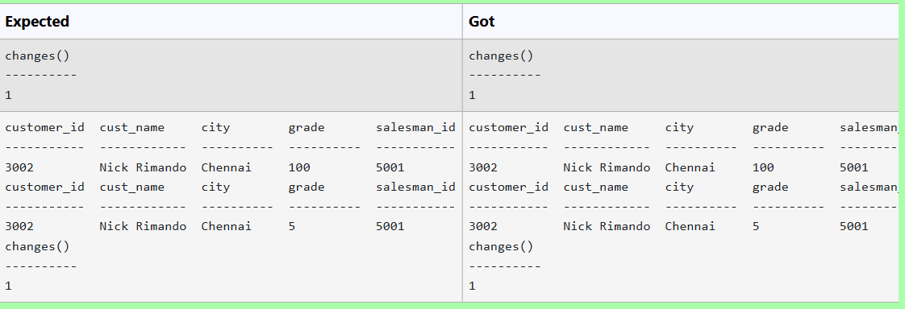
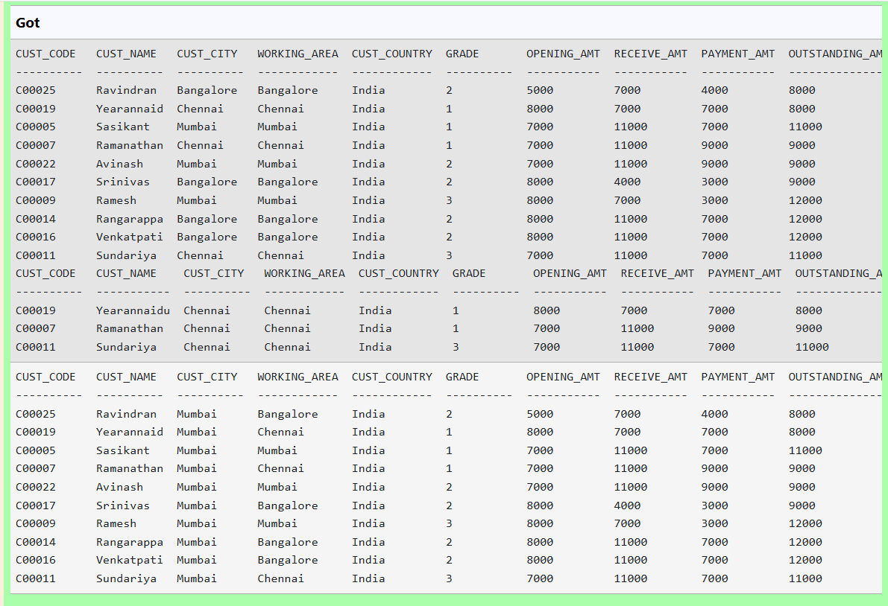
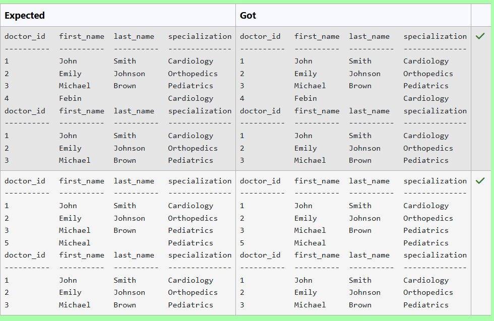
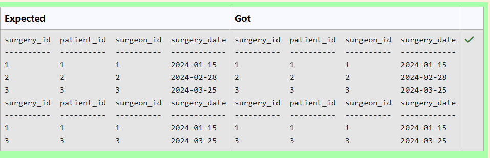
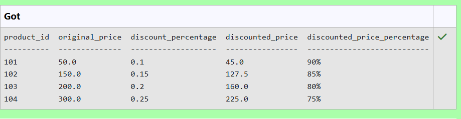
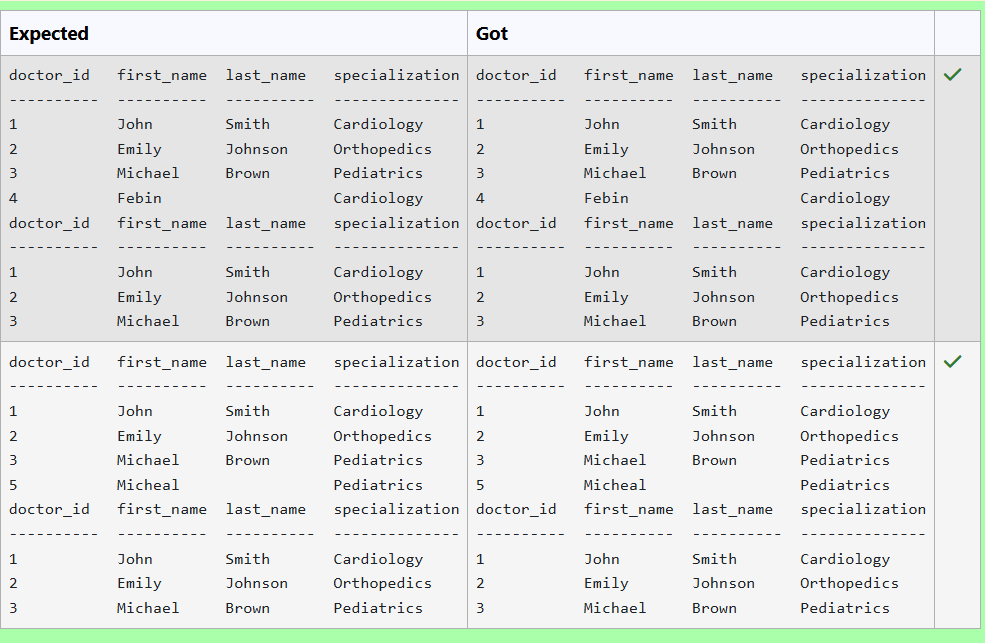

# Experiment 3: DML Commands

## AIM
To study and implement DML (Data Manipulation Language) commands.

## THEORY

### 1. INSERT INTO
Used to add records into a relation.
These are three type of INSERT INTO queries which are as
A)Inserting a single record
**Syntax (Single Row):**
```sql
INSERT INTO table_name (field_1, field_2, ...) VALUES (value_1, value_2, ...);
```
**Syntax (Multiple Rows):**
```sql
INSERT INTO table_name (field_1, field_2, ...) VALUES
(value_1, value_2, ...),
(value_3, value_4, ...);
```
**Syntax (Insert from another table):**
```sql
INSERT INTO table_name SELECT * FROM other_table WHERE condition;
```
### 2. UPDATE
Used to modify records in a relation.
Syntax:
```sql
UPDATE table_name SET column1 = value1, column2 = value2 WHERE condition;
```
### 3. DELETE
Used to delete records from a relation.
**Syntax (All rows):**
```sql
DELETE FROM table_name;
```
**Syntax (Specific condition):**
```sql
DELETE FROM table_name WHERE condition;
```
### 4. SELECT
Used to retrieve records from a table.
**Syntax:**
```sql
SELECT column1, column2 FROM table_name WHERE condition;
```
**Question 1**
--
Write a SQL statement to Increase the selling price per unit by 5% for product ID 15 who's sale is on '2023-01-31'.

sales(sale_id,sale_date,product_id,quantity,sell_price,total_sell_price)
-- 

```sql
UPDATE sales
SET sell_price=sell_price*1.05
WHERE product_id = 15 AND sale_date='2023-01-31';
```

**Output:**



**Question 2**
--
Update the total selling price to quantity sold multiplied by updated selling price per unit where product id is 10 in the sales table.

-- 

```sql
UPDATE sales
SET total_sell_price=quantity*sell_price
WHERE product_id=10;
```

**Output:**



**Question 3**
--
Write a SQL statement to Double the salary for employees in department 20 who have a job_id ending with 'MAN'

Employees table

---------------
employee_id
first_name
last_name
email
phone_number
hire_date
job_id
salary
commission_pct
manager_id
-- 

```sql
UPDATE employeeS SET salary = salary*2 WHERE department_id = 20 AND job_id LIKE '%MAN';
```

**Output:**



**Question 4**
--
Write a SQL statement to change the first_name column of employees table with 'John' for those employees whose department_id is 80 and gets a commission_pct below 0.35.

Employees table

---------------
employee_id
first_name
last_name
email
phone_number
hire_date
job_id
salary
commission_pct
manager_id
department_id
-- 

```sql
UPDATE employees
SET first_name='John'
WHERE department_id = 80 AND commission_pct<0.35;
```

**Output:**



**Question 5**
--
Write a SQL statement to Update the grade of all customers in Chennai city as  5. 
-- 

```sql
UPDATE customer
SET grade=5
WHERE city = 'Chennai';
```

**Output:**



**Question 6**
--
Write a SQL query to remove rows from the table 'customer' with the following condition -

1. 'cust_country' must be 'India',

2. 'cus_city' must not be 'Chennai',
-- 

```sql
DELETE FROM customer WHERE cust_country = 'India' AND cust_city <> 'Chennai';
```

**Output:**



**Question 7**
--
Write a SQL query to Delete All Doctors with a NULL Last Name

Sample table: Doctors

attributes : doctor_id, first_name, last_name, specialization
--

```sql
DELETE FROM doctors
WHERE last_name IS NULL;
```

**Output:**



**Question 8**
--
Write a SQL query to Delete a Specific Surgery which was made on 28th Feb 2024.

Sample table: Surgeries

attributes: surgery_id, patient_id, surgeon_id, surgery_date
-- 

```sql
DELETE FROM surgeries
WHERE surgery_date ='2024-02-28';
```

**Output:**



**Question 9**
--
Write a query to calculate the discounted_price and  discounted_price_percentage for each product from the products table. Return product_id, original_price, discount_percentage, discounted_price, and discounted_price_percentage.

Discounted Price: Calculate the price of the product after applying the discount.

Discounted Price Percentage: Calculate the percentage that the discounted price represents relative to the original price.
-- 

```sql
SELECT 
    product_id,
    original_price,
    discount_percentage,
    original_price*(1 -
discount_percentage) AS discounted_price,
    CAST((original_price * (1 -
discount_percentage))/original_price*
100 AS INT) || '%' AS
discounted_price_percentage
FROM
    products;
```

**Output:**



**Question 10**
--
Write a SQL query to Delete All Doctors with a NULL Last Name

Sample table: Doctors

attributes : doctor_id, first_name, last_name, specialization
-- 

```sql
DELETE FROM doctors
WHERE last_name IS NULL;
```

**Output:**



## RESULT
Thus, the SQL queries to implement DML commands have been executed successfully.
