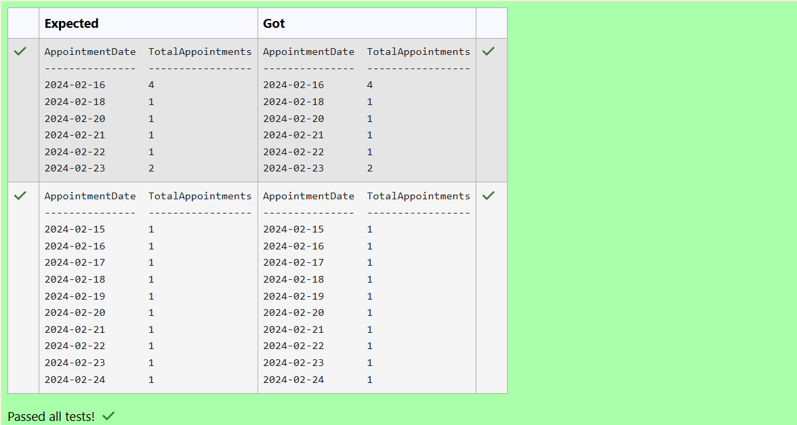
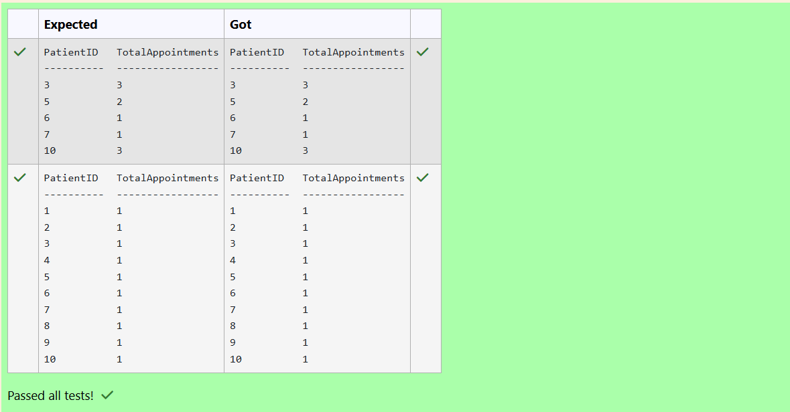
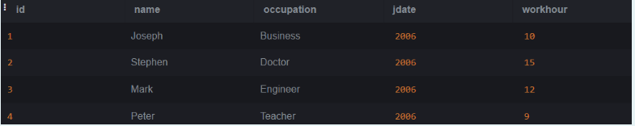
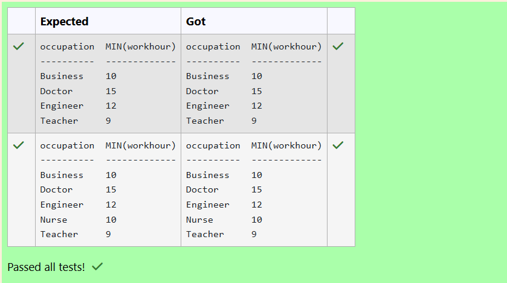
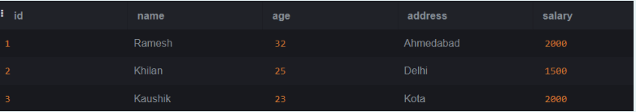
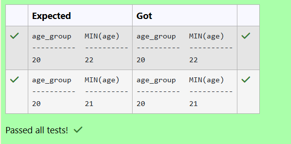
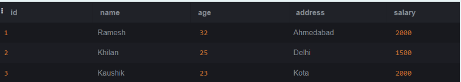
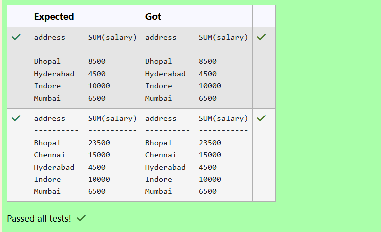
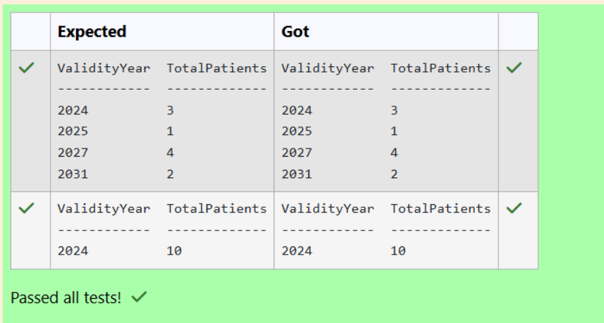

# Experiment 4: Aggregate Functions, Group By and Having Clause

## AIM
To study and implement aggregate functions, GROUP BY, and HAVING clause with suitable examples.

## THEORY

### Aggregate Functions
These perform calculations on a set of values and return a single value.

- **MIN()** – Smallest value  
- **MAX()** – Largest value  
- **COUNT()** – Number of rows  
- **SUM()** – Total of values  
- **AVG()** – Average of values

**Syntax:**
```sql
SELECT AGG_FUNC(column_name) FROM table_name WHERE condition;
```
### GROUP BY
Groups records with the same values in specified columns.
**Syntax:**
```sql
SELECT column_name, AGG_FUNC(column_name)
FROM table_name
GROUP BY column_name;
```
### HAVING
Filters the grouped records based on aggregate conditions.
**Syntax:**
```sql
SELECT column_name, AGG_FUNC(column_name)
FROM table_name
GROUP BY column_name
HAVING condition;
```

**Question 1**
--
<pre>
What is the total number of appointments scheduled for each day?

Table: Appointments

name                 type
-------------------  ----------
AppointmentID        INTEGER
PatientID            INTEGER
DoctorID             INTEGER
AppointmentDateTime  DATETIME
Purpose              TEXT
Status               TEXT
</pre>
-- 

```sql
SELECT
    DATE(AppointmentDateTime) AS
AppointmentDate,
    COUNT(*) AS TotalAppointments
FROM 
    Appointments
GROUP BY
    DATE(AppointmentDateTime)
ORDER BY
    AppointmentDate;
```

**Output:**



**Question 2**
--
<pre>
How many appointments are scheduled for each patient?

Sample table: Appointments Table

name                  type
--------------------  ----------
AppointmentID         INTEGER
PatientID             INTEGER
DoctorID              INTEGER
AppointmentDateTime   DATETIME
Purpose               TEXT
Status                TEXT
</pre>
-- 

```sql
SELECT
    PatientID,
    COUNT(*) AS TotalAppointments
FROM
    Appointments
GROUP BY
    PatientID
ORDER BY
    PatientID;
```

**Output:**



**Question 3**
--
<pre>
Write a SQL query to Calculate the average email length (in characters) for people who lives in Mumbai city

Table: customer

name        type
----------  ----------
id          INTEGER
name        TEXT   
city        TEXT
email       TEXT
phone       INTEGER
</pre>
-- 

```sql
SELECT
    AVG(LENGTH(email)) AS
avg_email_length_below_30
FROM
    customer
WHERE
    city='Mumbai';
```

**Output:**


**Question 4**
--

Write a SQL query to find What is the age difference between the youngest and oldest employee in the company.

Table: __employee__
<pre>
name        type
----------  ----------
id          INTEGER
name        TEXT
age         INTEGER
city        TEXT
income      INTEGER
</pre>
-- 

```sql
SELECT
    MAX(age) - MIN(age) AS age_difference
FROM employee;
```

**Output:**


**Question 5**
--
Write a SQL query to find the maximum purchase amount.

Sample table: orders
<pre>
ord_no      purch_amt   ord_date    customer_id  salesman_id

----------  ----------  ----------  -----------  -----------

70001       150.5       2012-10-05  3005         5002

70009       270.65      2012-09-10  3001         5005

70002       65.26       2012-10-05  3002         5001
</pre>
-- 

```sql
 SELECT 
    MAX(purch_amt) AS MAXIMUM
FROM orders;
```

**Output:**


**Question 6**
--
Write a SQL query to calculate total purchase amount of all orders. Return total purchase amount.

Sample table: orders
<pre>
ord_no      purch_amt   ord_date    customer_id  salesman_id

----------  ----------  ----------  -----------  -----------

70001       150.5       2012-10-05  3005         5002

70009       270.65      2012-09-10  3001         5005

70002       65.26       2012-10-05  3002         5001
</pre>
-- 

```sql
SELECT SUM(purch_amt) AS TOTAL
FROM orders;
```

**Output:**


**Question 7**
--
Write the SQL query that achieves the grouping of data by occupation, calculates the minimum work hours for each occupation, and excludes occupations where the minimum work hour is not greater than 8.

Sample table: employee1


-- 

```sql
SELECT occupation,MIN(workhour) AS
"MIN(workhour)"
FROM employee1
GROUP BY occupation
HAVING MIN(workhour) > 8;
```

**Output:**



**Question 8**
--
Write the SQL query that accomplishes the grouping of data by age intervals using the expression (age/5)5, calculates the minimum age for each group, and excludes groups where the minimum age is not less than 25.

Sample table: customer1


-- 

```sql
SELECT (age/5)*5 AS age_group, MIN(age) AS "MIN(age)" FROM customer1 GROUP BY (age/5)*5 HAVING MIN(age) < 25 ORDER BY age_group;
```

**Output:**



**Question 9**
--
Write the SQL query that accomplishes the grouping of data by addresses, calculates the sum of salaries for each address, and excludes addresses where the total salary sum is not greater than 2000.

Sample table: customer1


-- 

```sql
SELECT address, SUM(salary) AS
"SUM(salary)"
FROM customer1
GROUP BY address
HAVING SUM(salary)>2000;
```

**Output:**



**Question 10**
--
How many patients have insurance coverage valid in each year?

Sample table:Insurance Table

<pre>
name               type
-----------------  ----------
InsuranceID        INTEGER
PatientID          INTEGER
InsuranceCompany   TEXT
PolicyNumber       TEXT
PolicyHolder       TEXT
ValidityPeriod     TEXT
-- 
</pre>

```sql
SELECT CAST(ValidityPeriod AS INTEGER) AS ValidityYear,
COUNT(DISTINCT PatientID) AS TotalPatients
FROM Insurance
GROUP BY ValidityYear
ORDER BY ValidityYear;
```

**Output:**




## RESULT
Thus, the SQL queries to implement aggregate functions, GROUP BY, and HAVING clause have been executed successfully.
