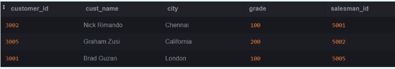
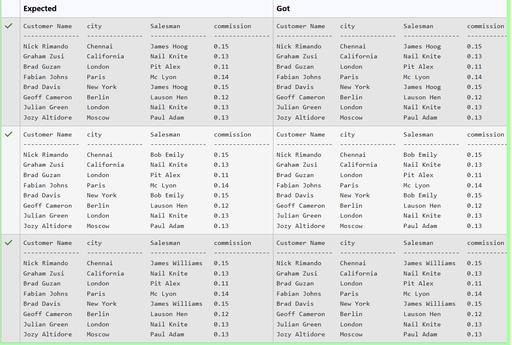
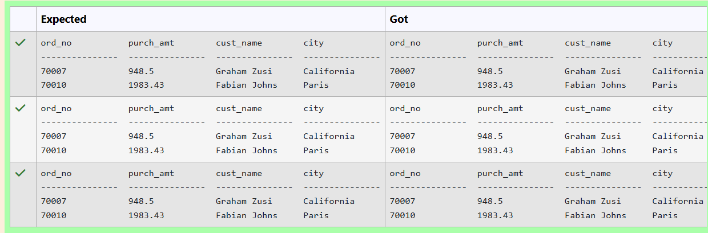

# Experiment 6: Joins

## AIM
To study and implement different types of joins.

## THEORY

SQL Joins are used to combine records from two or more tables based on a related column.

### 1. INNER JOIN
Returns records with matching values in both tables.

**Syntax:**
```sql
SELECT columns
FROM table1
INNER JOIN table2
ON table1.column = table2.column;
```

### 2. LEFT JOIN
Returns all records from the left table, and matched records from the right.

**Syntax:**

```sql
SELECT columns
FROM table1
LEFT JOIN table2
ON table1.column = table2.column;
```
### 3. RIGHT JOIN
Returns all records from the right table, and matched records from the left.

**Syntax:**

```sql
SELECT columns
FROM table1
RIGHT JOIN table2
ON table1.column = table2.column;
```
### 4. FULL OUTER JOIN
Returns all records when there is a match in either left or right table.

**Syntax:**

```sql
SELECT columns
FROM table1
FULL OUTER JOIN table2
ON table1.column = table2.column;
```

**Question 1**
--
Write the SQL query that achieves the selection of the "name" column from the "salesman" table (aliased as "s"), with a left join on the "salesman_id" column and a condition filtering for customers in the city 'London'.

Customer Table:


-- 


```sql
SELECT s.name
FROM customer c
LEFT JOIN salesman s ON c.salesman_id = s.salesman_id
WHERE c.city = 'London';
```

**Output:**


**Question 2**
--
Write the SQL query that achieves the selection of all columns from the "customer" table (aliased as "c"), with a left join on the "customer_id" column and a condition filtering for orders with an order date between '2012-07-01' and '2012-07-30'.

CUSTOMER TABLE:




-- 

```sql
SELECT c.*
FROM customer c
LEFT JOIN orders o ON c.customer_id = o.customer_id
WHERE o.ord_date BETWEEN '2012-07-01' AND '2012-07-30';

```

**Output:**


**Question 3**
--
 From the following tables write a SQL query to find the salesperson(s) and the customer(s) he represents. Return Customer Name, city, Salesman, commission.

Sample table: customer
<pre>
 customer_id |   cust_name    |    city    | grade | salesman_id 
-------------+----------------+------------+-------+-------------
        3002 | Nick Rimando   | New York   |   100 |        5001
        3007 | Brad Davis     | New York   |   200 |        5001
        3005 | Graham Zusi    | California |   200 |        5002
        3008 | Julian Green   | London     |   300 |        5002
        3004 | Fabian Johnson | Paris      |   300 |        5006
        3009 | Geoff Cameron  | Berlin     |   100 |        5003
        3003 | Jozy Altidor   | Moscow     |   200 |        5007
        3001 | Brad Guzan     | London     |       |        5005
Sample table: salesman

 salesman_id |    name    |   city   | commission 
-------------+------------+----------+------------
        5001 | James Hoog | New York |       0.15
        5002 | Nail Knite | Paris    |       0.13
        5005 | Pit Alex   | London   |       0.11
        5006 | Mc Lyon    | Paris    |       0.14
        5007 | Paul Adam  | Rome     |       0.13
        5003 | Lauson Hen | San Jose |       0.12
</pre>
-- 

```sql
SELECT 
    c.cust_name AS "Customer Name",
    c.city,
    s.name AS "Salesman",
    s.commission
FROM 
    customer c
INNER JOIN 
    salesman s
ON 
    c.salesman_id = s.salesman_id;

```

**Output:**

](image-5.png)

**Question 4**
--
Write the SQL query that achieves the selection of the first name from the "patients" table (aliased as "patient_name") and the first name from the "doctors" table (aliased as "doctor_name"), with an inner join on the "doctor_id" column and a condition filtering for patients with a null discharge date.

PATIENTS TABLE:

ATTRIBUTES - patient_id, first_name, last_name, date_of_birth, admission_date, discharge_date, doctor_id


-- 

```sql
SELECT 
    p.first_name AS patient_name,
    d.first_name AS doctor_name
FROM 
    patients p
INNER JOIN 
    doctors d
ON 
    p.doctor_id = d.doctor_id
WHERE 
    p.discharge_date IS NULL;

```

**Output:**


**Question 5**
--
Write the SQL query that achieves the selection of the first name from the "patients" table (aliased as "patient_name") and the specialization from the "doctors" table (aliased as "Doctor_specialization"), with an inner join on the "doctor_id" column and a condition filtering for patients admitted between '2024-01-01' and '2024-01-31'.

PATIENTS TABLE:
<pre>
name             type
---------------  ---------------
patient_id       INT
first_name       VARCHAR(50)
last_name        VARCHAR(50)
date_of_birth    DATE
admission_date   DATE
discharge_date   DATE
doctor_id        INT

DOCTORS TABLE:

name             type
---------------  ---------------
doctor_id        INT
first_name       VARCHAR(50)
last_name        VARCHAR(50)
specialization   VARCHAR(100)
</pre>
--

```sql
SELECT 
    p.first_name AS patient_name,
    d.specialization AS Doctor_specialization
FROM 
    patients p
INNER JOIN 
    doctors d
ON 
    p.doctor_id = d.doctor_id
WHERE 
    p.admission_date BETWEEN '2024-01-01' AND '2024-01-31';

```

**Output:**


**Question 6**
--
From the following tables write a SQL query to find those customers with a grade less than 300. Return cust_name, customer city, grade, Salesman, salesmancity. The result should be ordered by ascending customer_id. 

Sample table: customer
<pre>

 customer_id |   cust_name    |    city    | grade | salesman_id 
-------------+----------------+------------+-------+-------------
        3002 | Nick Rimando   | New York   |   100 |        5001
        3007 | Brad Davis     | New York   |   200 |        5001
        3005 | Graham Zusi    | California |   200 |        5002
        3008 | Julian Green   | London     |   300 |        5002
        3004 | Fabian Johnson | Paris      |   300 |        5006
        3009 | Geoff Cameron  | Berlin     |   100 |        5003
        3003 | Jozy Altidor   | Moscow     |   200 |        5007
        3001 | Brad Guzan     | London     |       |        5005
Sample table: salesman

 salesman_id |    name    |   city   | commission 
-------------+------------+----------+------------
        5001 | James Hoog | New York |       0.15
        5002 | Nail Knite | Paris    |       0.13
        5005 | Pit Alex   | London   |       0.11
        5006 | Mc Lyon    | Paris    |       0.14
        5007 | Paul Adam  | Rome     |       0.13
        5003 | Lauson Hen | San Jose |       0.12
</pre>
-- 

```sql
SELECT 
    c.cust_name, 
    c.city, 
    c.grade, 
    s.name AS Salesman, 
    s.city AS city
FROM 
    customer c
INNER JOIN 
    salesman s
ON 
    c.salesman_id = s.salesman_id
WHERE 
    c.grade < 300
ORDER BY 
    c.customer_id ASC;

```

**Output:**


**Question 7**
--
From the following tables write a SQL query to find those orders where the order amount exists between 500 and 2000. Return ord_no, purch_amt, cust_name, city.

Sample table: customer
<pre>

 customer_id |   cust_name    |    city    | grade | salesman_id 
-------------+----------------+------------+-------+-------------
        3002 | Nick Rimando   | New York   |   100 |        5001
        3007 | Brad Davis     | New York   |   200 |        5001
        3005 | Graham Zusi    | California |   200 |        5002
        3008 | Julian Green   | London     |   300 |        5002
        3004 | Fabian Johnson | Paris      |   300 |        5006
        3009 | Geoff Cameron  | Berlin     |   100 |        5003
        3003 | Jozy Altidor   | Moscow     |   200 |        5007
        3001 | Brad Guzan     | London     |       |        5005
Sample table: orders

ord_no      purch_amt   ord_date    customer_id  salesman_id
----------  ----------  ----------  -----------  -----------
70001       150.5       2012-10-05  3005         5002
70009       270.65      2012-09-10  3001         5005
70002       65.26       2012-10-05  3002         5001
70004       110.5       2012-08-17  3009         5003
70007       948.5       2012-09-10  3005         5002
70005       2400.6      2012-07-27  3007         5001
70008       5760        2012-09-10  3002         5001
70010       1983.43     2012-10-10  3004         5006
70003       2480.4      2012-10-10  3009         5003
70012       250.45      2012-06-27  3008         5002
70011       75.29       2012-08-17  3003         5007
70013       3045.6      2012-04-25  3002         5001
</pre>
-- 

```sql
SELECT 
    o.ord_no,
    o.purch_amt,
    c.cust_name,
    c.city
FROM 
    orders o
INNER JOIN 
    customer c
ON 
    o.customer_id = c.customer_id
WHERE 
    o.purch_amt BETWEEN 500 AND 2000;

```

**Output:**



**Question 8**
--
Write the SQL query that achieves the selection of the first name from the "patients" table (aliased as "patient_name") and all columns from the "test_results" table (aliased as "t"), with an inner join on the "patient_id" column and a condition filtering for patients admitted between '2024-01-01' and '2024-01-31'.

PATIENTS TABLE:

ATTRIBUTES - patient_id, first_name, last_name, date_of_birth, admission_date, discharge_date, doctor_id


-- 

```sql
SELECT 
    p.first_name AS patient_name,
    t.*
FROM 
    patients p
INNER JOIN 
    test_results t ON p.patient_id = t.patient_id
WHERE 
    p.admission_date BETWEEN '2024-01-01' AND '2024-01-31';

```

**Output:**


**Question 9**
--
write a SQL query to find the salesperson and customer who reside in the same city. Return Salesman, cust_name and city.

Sample table: salesman

<pre>

 salesman_id |    name    |   city   | commission 
-------------+------------+----------+------------
        5001 | James Hoog | New York |       0.15
        5002 | Nail Knite | Paris    |       0.13
        5005 | Pit Alex   | London   |       0.11
        5006 | Mc Lyon    | Paris    |       0.14
        5007 | Paul Adam  | Rome     |       0.13
        5003 | Lauson Hen | San Jose |       0.12
Sample table: customer

 customer_id |   cust_name    |    city    | grade | salesman_id 
-------------+----------------+------------+-------+-------------
        3002 | Nick Rimando   | New York   |   100 |        5001
        3007 | Brad Davis     | New York   |   200 |        5001
        3005 | Graham Zusi    | California |   200 |        5002
        3008 | Julian Green   | London     |   300 |        5002
        3004 | Fabian Johnson | Paris      |   300 |        5006
        3009 | Geoff Cameron  | Berlin     |   100 |        5003
        3003 | Jozy Altidor   | Moscow     |   200 |        5007
        3001 | Brad Guzan     | London     |       |        5005
</pre>
--

```sql
SELECT 
    s.name AS Salesman,
    c.cust_name,
    s.city
FROM 
    salesman s
JOIN 
    customer c ON s.city = c.city;

```

**Output:**


**Question 10**
--
Write the SQL query that achieves the selection of the "nurse_id" from the "nurses" table (aliased as "n") and the "department_name" from the "departments" table, with an inner join on the "department_id" column and conditions filtering for a nurse with the first name 'David' and last name 'Moore'.

NURSES TABLE:

ATTRIBUTES - nurse_id, first_name, last_name, department_id


-- 

```sql
SELECT 
    n.nurse_id, 
    d.department_name
FROM 
    nurses n
INNER JOIN 
    departments d ON n.department_id = d.department_id
WHERE 
    n.first_name = 'David' 
    AND n.last_name = 'Moore';

```

**Output:**


## RESULT
Thus, the SQL queries to implement different types of joins have been executed successfully.
